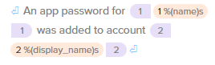

# Final_project

201721851 심리학과 방재연  
Transifex 프로필 : https://www.transifex.com/user/profile/qkdwodus777/

-----

## 목차

1. 개요
1. Bitbuket 소개
1. 번역
1. 결과 
1. 느낀점 
1. 참고자료

-------

## 개요

오픈 소스 강의를 통해 Transifex 사이트에 대해 알게 되었습니다.  
그리고 이를 통해, 오픈소스 관련 컨텐츠에 직접 기여할 수 있는 기회를 갖게 되었습니다.   
저는 Atlassian의 bitbucket이라는 프로그램 번역에 참여하여, 기여하게 되었습니다.   

------

## Bitbuket 소개

Bitbucket은 Atlassian 소유의 웹 기반 버전 관리 저장소 호스팅 서비스입니다.   
Git 버전 관리 시스템을 사용하는 소스 코드 및 개발 프로젝트를 위한 서비스입니다.   
무료 계정의 경우 무제한 수의 개인 저장소(무료 계정의 경우 최대 5명의 사용자 보유 가능)를 제공합니다. [^1] 

-------

## 번역

#### 번역방법

    Bitbuket은 Git code 관리 시스템이기에, Git에서 쓰이는 용어들에 대해 번역이 필요하였습니다.   
    Branch, Fork, pull 등, 사전 그대로 번역하면, 나뭇가지, 포크, 당기다이지만, 이는 그 본연의 의미를 나타내지 못한다고 생각했습니다.   
    그래서 이러한 어휘들은 원어 그대로 살려 번역함으로써 (ex, branch, fork, pull) Git과 Bitbucket의 사용자에게 혼란을 줄이고자 하였습니다.   

    또한 번역을 함에 있어, 여러가지 특수 기호들을 사용했어야 했습니다.  
    그러한 점을 고려하여, 목적어, 서술어 등을 배치한 후, 최대한 원문에 가까운 위치에 특수 기호들을 사용하고자 하였습니다.   이러한 특수기호들은 먼저 문장을 번역 한 후, 알맞은 위치에 특수기호를 클릭하여 넣는 방식으로 진행하였습니다. 

    저는 웹 상에서 번역을 진행하였습니다. 이 경우 여러 장점이 있습니다.   
    깔끔한 인터페이스로 진행 가능하고, History와 Suggestion을 볼 수 있는 점입니다.  
    특히 Suggestion의 경우, 다른 문장의 번역본과 이 문장의 번역본을 비교하여, 추천해 주는 시스템입니다.   
    이 경우 다른 번역본을 참고할 수 있으며, 특수 어휘의 경우 이를 참고하여 번역의 일관성을 유지할 수 있었습니다.  

-------

## 결과 

  

    총 4318개의 단어를 번역하였습니다.  
    (이중 일부는 번역 이전의 파일을 저장하지 못하여, 번역 파일에서 누락되었습니다.) 

------

## 느낀점

    저에게 이러한 오픈소스 프로젝트에 기여한다는 것은 처음 있는 일이었습니다.   
    이를 통해, 오픈소스라는 것에 대한 호기심이 커졌으며, 저도 저만의 방식으로 이러한 프로젝트에 기여하고 싶다는 생각이 생겼습니다.    
    저도 언젠가 저만의 오픈소스 프로그램을 만들고,   
    이러한 번역 프로젝트를 통해 세계인과 공유하며,   
    사람들과 함께 새로운 것을 구축해 나가는 일을 하고 싶습니다. 

------

#### 참고자료

- TTA 정보통신 용어사전 : http://word.tta.or.kr/main   
- 국립국어원 : https://stdict.korean.go.kr/main/main.do
[^1]: https://ko.wikipedia.org/wiki/%EB%B9%97%EB%B2%84%ED%82%B7#cite_note-2
